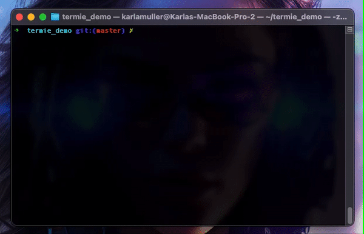

# Termie

Termie is a Python script that utilizes the OpenAI API to generate and execute shell commands based on user input.

## Usage

1. **Make the Script Executable:**

   To make the script executable, you can use the following command in your terminal:

   ```bash
   chmod +x termie
   ```

2. **Adding a Symbolic Link to Bin**

    To easily call the script from the terminal, create a symbolic link to the bin directory (or any directory in your system's PATH). For instance:

   ```bash
   ln -s /path/to/termie /usr/local/bin/termie
   ```

    Now you can run the script by simply typing termie in the terminal followed by your question as a string. For example:

    ```bash
    termie 'how do i remove all files that contain the extension .mp3 or .mp4?'
    ```

3. **Adding the Environment Variable for OpenAI API Key**

    Before using Termie, ensure you have your OpenAI API key set as an environment variable. You can do this by adding the following line to your shell profile (e.g., .bashrc, .zshrc):

    ```bash
    export OPENAI_API_KEY=your_api_key_here
    ```

4. **Additional Steps**

    You're almost set, but a few more considerations to keep in mind:

    Make sure you have the required Python packages installed. You can install them using pip:

    ```bash 
    pip install openai
    ```

    Customize the OpenAI model and other parameters according to your needs within the termie script.

## Disclaimer

Termie utilizes the OpenAI API. Exercise caution regarding costs and potential risks. Adhere to OpenAI's usage guidelines and handle sensitive data responsibly.

## Termie in action

